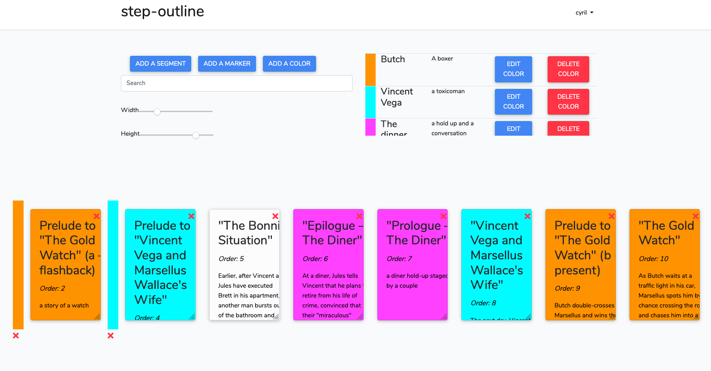

# Step-Outline-App
<strong>A project with Laravel and VueJs. You can write a step-outline for a cinema script on cards. With drag and drog you can change order of the segments.</strong>

<a href="https://www.youtube.com/watch?v=XsbLys-lbjg">Link to a demo on youtube</a>

<ol>
  <li>clone the repo and cd into it</li>
  <li>composer install</li>
  <li>Enter your database credentials in your .env file</li>
  <li>php artisan migrate</li>
  <li>php artisan key:generate</li>
  <li>npm install</li>
  <li>npm run watch</li>
</ol>
